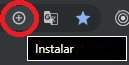

# Documentacion Blanca Javi
> ### Página con documentación sobre tecnologías FRONT

## Authors

* **Blanca Ros San Juan** - [BlancaRos](https://github.com/BlancaRos)
* **Javier García González** - [javiggpecas](https://github.com/javiggpecas)

## Empezando

Es necesario tener instalado [Node JS](https://nodejs.org/es/), luego se instala [Angular CLI](https://cli.angular.io/) (`npm i @angular/cli`) y a continuacion se ejecuta `npm i` para instalar las librerias que necesita la PWA.

Ejecute `ng serve` para iniciar el servidor de desarrollo y navege a `http://localhost:4200/`.

### Building the project
Ejecute `ng build` para obtener un compilado del proyecto. El proyecto generado se almacenará en la carpeta `/dist`. Use la flag `-prod` para realizar la compilación en modo producción.

### HTTP-SERVER instalar PWA
Es necesario tener instalado [http-server](https://www.npmjs.com/package/http-server) `npm i http-server -g` y haber compilado el proyecto en modo producción `ng build --prod`.

En la carpeta creada en `/dist/nombre-proyecto` se ejecuta el siguiente comando para crear un servidor en el pc capaz de ejecutar el compilado:

    http-server -p 8080

Una vez iniciado google chrome se selecciona la opccion intalar en la barra de navegación:

## Internet Explorer

Estan habilitados todos los polyfills necesarios para que la PWA funcione en IE.

Para poder iniciar la aplicacion en Internet Explorer es necesario ejecutarla en ECMAScript 5 (ES5) mediante el comando:
    
    ng serve --configuration es5

